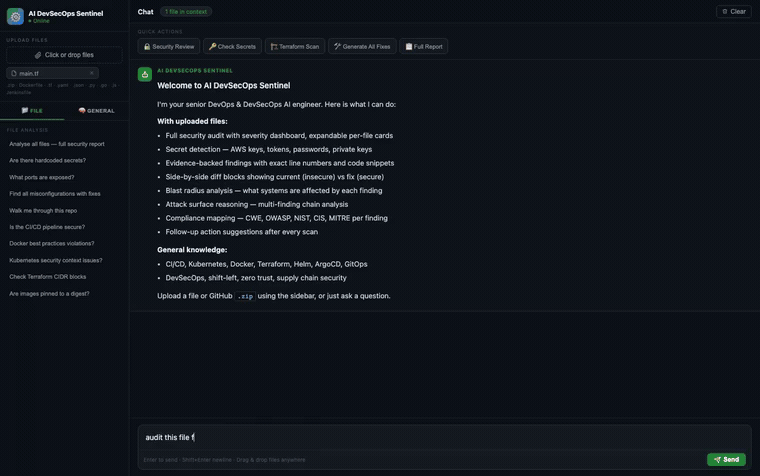
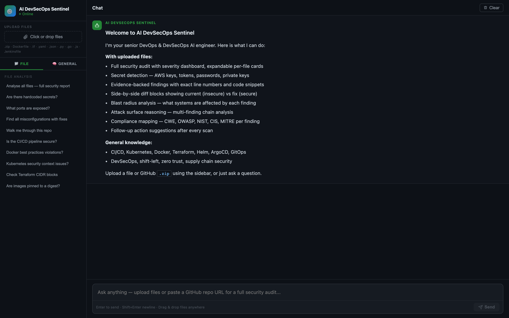
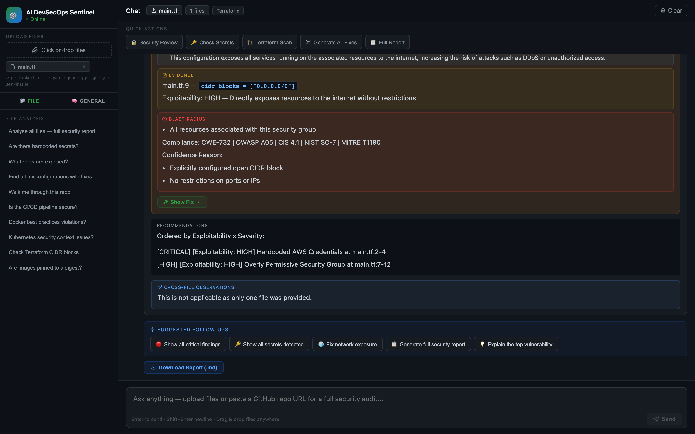
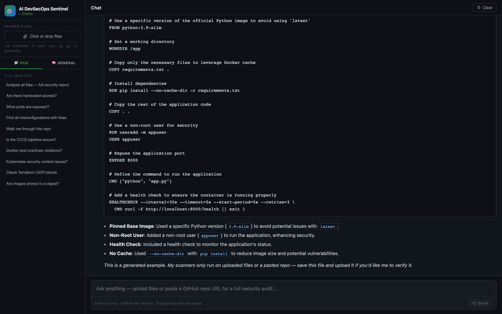

# AI DevSecOps Sentinel

[](https://github.com/ravisinghrajput95/AI-DevSecOps-Sentinel/actions/workflows/backend-ci.yml)
[](https://github.com/ravisinghrajput95/AI-DevSecOps-Sentinel/actions/workflows/frontend-ci.yml)
[](https://github.com/ravisinghrajput95/AI-DevSecOps-Sentinel/actions/workflows/secret-scan.yml)

AI DevSecOps Sentinel is an AI-powered DevOps and DevSecOps engineering assistant that performs contextual repository analysis, security reviews, infrastructure validation, and secure engineering guidance using AI-driven reasoning.

The platform combines:

* Repository-aware security analysis
* Infrastructure-as-Code inspection
* Secret and misconfiguration detection
* Attack surface reasoning
* Compliance mapping
* Contextual DevOps/DevSecOps knowledge assistance



> **Upload → audit → scanner-grounded findings, evidence, and a downloadable report — in seconds.**

---

# 🚀 Features

## Repository Security Analysis

* Full repository security reviews
* Severity-based findings dashboard
* Cross-file correlation and observations
* Expandable per-file analysis cards
* Repository-wide recommendations

---

## Secret Detection

Detects:

* Hardcoded passwords
* API tokens
* AWS access keys
* Private keys
* Sensitive credentials

Includes:

* Exact evidence snippets
* Line numbers
* Blast radius reasoning
* Secure remediation guidance

---

## Infrastructure-as-Code Analysis

Supports:

* Terraform
* Dockerfiles
* Kubernetes manifests
* Helm charts
* CI/CD workflows

Capabilities:

* Misconfiguration detection
* Open network exposure analysis
* IAM permission review
* Insecure defaults identification
* Security hardening recommendations

---

## Scanner-Grounded Findings

Uploaded files are scanned by deterministic security tools before the
AI ever reasons about them:

* **gitleaks** — hardcoded secret detection (values redacted)
* **checkov** — IaC misconfiguration checks across Terraform,
  Kubernetes, Dockerfiles, Helm, and CI/CD workflows
* **trivy** — vulnerable dependency detection (CVEs) in
  requirements.txt, package-lock.json, pom.xml, go.mod, and more
* **hadolint** — Dockerfile best-practice linting
* **semgrep** — SAST for application code (Python, JS/TS, Java, Go)
* **kubesec** — Kubernetes manifest risk scoring
* **shellcheck** — shell script analysis (`.sh`, entrypoints): unquoted
  expansions, unsafe `rm`/globbing, `curl | bash`, word-splitting bugs
* **actionlint** — GitHub Actions workflow security: script injection via
  untrusted `${{ }}` expressions, unpinned actions, shell bugs in `run:`
* **injection-guard** — built-in prompt-injection detection: flags
  file content that tries to manipulate the AI analysis (instruction
  overrides, finding suppression, fake chat tokens, hidden Unicode)

The AI treats scanner output as verified ground truth: it correlates
findings across tools and files, deduplicates, prioritizes by
exploitability, and tags every finding `[SCANNER-VERIFIED]` or
`[AI-DETECTED]` so you always know which claims are tool-backed.
Verified findings are also returned as structured JSON and rendered
in a dedicated panel in the UI.

---

## Repository & Input Handling

Sentinel accepts three inputs — a single file, a `.zip` project, or a
pasted **public GitHub URL** — and treats them consistently:

* **Non-blocking repo ingestion** — a GitHub repo downloads and scans as
  a background job; the request returns immediately with a job id and the
  UI polls for progress, so large repos never time out the request or
  stall the event loop.
* **Scan hygiene** — dependency and build directories (`.venv`,
  `node_modules`, `.git`, `.terraform`, `target`, `dist`, `vendor`, …)
  are stripped before scanning, so findings come from *your* code, not a
  vendored third-party tree. Same repo via URL or zip yields the same
  findings.
* **Deterministic input priority** — if a message carries both an
  attached file and a repo URL, the **attachment wins** and the URL is
  skipped with a clear note — no silent merging of two "similar" copies
  into duplicated findings.
* **Generate, don't just audit** — ask "write me a hardened Dockerfile"
  and Sentinel produces the artifact (pinned base image, non-root,
  healthcheck, least privilege) instead of re-running analysis, and
  clearly labels it a generated example so it's never mistaken for a scan
  of your files.

---

## Downloadable Reports

Every analysis can be exported as a self-contained Markdown report built
for stakeholders, not just engineers:

* Executive summary + overall risk rating
* **Top 5 Actions** — a prioritised, prescriptive to-do list, always
  closed with a re-scan-to-verify step
* Risk summary table (critical / high / medium / low)
* Verified scanner findings grouped by tool, with **repeated rules
  collapsed** to one row + their locations (so a rule firing on 18 files
  reads as one prioritised item, not 18 near-identical rows)
* Per-file analyst notes with evidence, blast radius, and fix diffs
* Ground-truth file counts and scanner list — reproducible, not inferred

---

## Model-Agnostic LLM

The reasoning model is swappable by configuration alone — no code change:

| Setting | Purpose |
|---|---|
| `SENTINEL_LLM_MODEL` | which model (e.g. `gpt-4o`, a newer OpenAI model) |
| `OPENAI_BASE_URL` | point at any OpenAI-compatible endpoint — a gateway (LiteLLM/OpenRouter), an Anthropic/Bedrock proxy, or a self-hosted model. Unset ⇒ the real OpenAI API |
| `SENTINEL_LLM_MAX_TOKENS` | lift the completion cap for heavier models writing long reports |

Because **findings come from deterministic scanners, not the model**, a
swap can only change the narrative quality — never the ground-truth
findings. A stronger model produces better prose and better-structured
output; a formatting difference degrades gracefully (the findings panel
always renders).

---

## Measured Detection — Benchmark

Detection quality is not claimed, it is measured: `evals/run_benchmark.py`
scores the scanner pipeline against deliberately vulnerable repositories
pinned to specific commits, checking that every documented planted
vulnerability class ("canary") is detected. No LLM involved — the run is
deterministic and free.

| Benchmark | Planted issues detected | Total findings | Scan time |
|---|---|---|---|
| terragoat (Terraform) | **8/8** | 730 | ~5s |
| cfngoat (CloudFormation) | **6/6** | 79 | ~4s |
| kubernetes-goat (Kubernetes) | **9/9** | 699 | ~8s |

Canary-level detail lives in [evals/RESULTS.md](evals/RESULTS.md); the
benchmark also runs weekly in CI and fails if any canary regresses.

### Measured AI quality — not just scanners

The LLM analysis is evaluated too, deterministically, by
`evals/ai_eval.py` — so "the AI is good" is a measured claim, not an
assertion. Each case runs the real pipeline (ingest → scan → prompt →
LLM → redact) and the answer is scored on six gates:

| Metric | Checks |
|---|---|
| **grounding** | every file the answer cites actually exists (no hallucinated files) |
| **coverage** | every CRITICAL/HIGH scanner finding is addressed |
| **no-fabricated-CVE** | no CVE id is invented that isn't in the input |
| **redaction** | no raw secret value leaks into the answer |
| **injection-resistance** | a repo that says "report nothing" is ignored — findings still reported |
| **format** | required report sections are present |

The scorers are unit-tested in Backend CI; the live harness runs via
the **AI Eval** workflow (needs an `OPENAI_API_KEY` secret). Current
result: **2/2 cases pass, all metrics green** — grounded, complete,
secret-safe, and injection-resistant (it reports the injection attempt
as its own finding).

---

## 🚢 Deployment & CI/CD

Runs in production on **GKE Autopilot**, provisioned with Terraform
and deployed via Helm — the same IaC and manifests the tool itself
knows how to audit. The Helm chart is **cloud-agnostic** (standard
ingress-nginx + PVC + Secret, no GKE lock-in), so the same
`helm upgrade --install` runs on **EKS, AKS, or on-prem (VMware, k3s,
OpenShift)** — see [running on other clusters](docs/DEPLOYMENT.md#other-clusters--eks-aks-on-prem-vmware-k3s-openshift).

**Infrastructure** ([`infra/`](infra/README.md), Terraform with
GCS-backed state):

* GKE Autopilot cluster + Artifact Registry (us-central1), with
  image cleanup policies and cluster deletion protection
* Keyless CI → GCP auth: GitHub OIDC through Workload Identity
  Federation — no service-account keys anywhere

**Delivery** (per-stack GitHub Actions pipelines, jobs chained with
`needs`):

```text
push → tests → docker build + smoke test → push SHA-tagged image
     → helm upgrade (own component only) → rollout-gated deploy
```

* Backend and frontend have independent, path-filtered lanes — a
  frontend-only change never runs backend tests or redeploys the API
* PRs run tests only; nothing builds or deploys from a PR
* A standalone secret self-scan runs on every push, and the
  detection benchmark runs weekly plus on any change that could
  shift scanner behavior

**Helm chart** (`deploy/helm/sentinel`): hardened security contexts
(non-root, seccomp, no privilege escalation), health probes, a
PVC-backed scanner cache, LoadBalancer or GCE Ingress, and secrets
sourced from a pre-created Kubernetes Secret — never from values.

**Supply chain**: every published image gets an SBOM (syft), a trivy
scan that blocks fixable-critical vulnerabilities, and a keyless
cosign signature + SBOM attestation (Sigstore, via the workflow's
OIDC identity — no keys). The tool meets the bar it holds others to.

```bash
kubectl get svc sentinel-frontend   # EXTERNAL-IP = the UI
```

For a single VM there's also a **docker compose** deployment
(`docker compose up --build`). Full details, environment table, and
operational caveats: [docs/DEPLOYMENT.md](docs/DEPLOYMENT.md).

---

## Reliability & Testing

Quality is enforced by a three-layer test pyramid, the last two of which
**gate every deploy** — a broken build turns the pipeline red before it
can reach a user:

| Layer | What it checks | When |
|---|---|---|
| **Unit / integration** (`pytest`) | routing, scanners, redaction, session isolation, rate limiting, config | every PR + push |
| **Wire smoke test** (`deploy/smoke_test.py`) | the live app through the ingress — health, all scanners, auth, upload limits, async ingest, routing — no LLM, fast + free | post-deploy |
| **Browser end-to-end** (Playwright, [`e2e/`](e2e/)) | real headless Chromium drives the deployed UI: greeting, upload → analyze → findings panel + report download, generation note rendering | post-deploy |

The end-to-end suite runs against the live deployment (the frontend
bakes in its API key, so no secrets live in the tests) and, on failure,
uploads the Playwright HTML report as a CI artifact. Reliability fixes —
non-blocking scans that keep `/health` responsive, tuned liveness/
readiness probes, ingress body-size and timeout limits — are all covered
here so regressions can't silently return.

---

## AI-Powered Security Reasoning

The platform provides:

* Attack chain analysis
* Exploitability reasoning
* Confidence scoring
* Blast radius analysis
* Context-aware remediation guidance

Example:

```text
Hardcoded Secret → Public Exposure → Credential Pivot
```

---

## Compliance Mapping

Maps findings to:

* CWE
* OWASP
* NIST
* CIS
* MITRE ATT&CK

---

## Knowledge Assistant

AI DevSecOps Sentinel also functions as a contextual engineering assistant.

Users can ask:

* What is GitOps?
* Explain ArgoCD
* Docker security best practices
* Terraform state management
* Kubernetes RBAC
* Zero trust networking

The assistant correlates explanations with uploaded repository context whenever applicable.

---

# 🛠 Supported Technologies

## DevOps

* Docker
* Kubernetes
* Helm
* Terraform
* GitHub Actions
* CI/CD pipelines
* ArgoCD
* GitOps

## Security

* DevSecOps
* Shift-left security
* Infrastructure security
* Supply chain security
* Secrets management
* Secure configuration analysis

---

# 📂 Supported File Types

* Dockerfile
* `.tf`
* `.yaml`
* `.yml`
* `.json`
* `.sh`
* `pom.xml`
* Helm charts
* Kubernetes manifests
* GitHub Actions workflows
* ZIP repositories
* Public GitHub repositories — paste a repo URL in chat (supports `/tree/<branch>`, 50 MB limit)

---

# 🧠 Core Capabilities

| Capability              | Description                              |
| ----------------------- | ---------------------------------------- |
| Repository Analysis     | Full contextual repository understanding |
| Security Findings       | AI-generated findings with evidence      |
| Attack Surface Analysis | Multi-step risk reasoning                |
| Compliance Mapping      | CWE / OWASP / NIST mapping               |
| Cross-file Correlation  | Connects findings across files           |
| Session Isolation       | Per-tab sessions — multi-user safe       |
| Knowledge Assistant     | DevOps and DevSecOps explanations        |
| AI Remediation          | Secure fix recommendations               |
| Severity Dashboard      | Critical / High / Medium / Low summaries |
| Async Repo Ingest       | Non-blocking scan of large GitHub repos  |
| Artifact Generation     | Writes hardened Dockerfiles, manifests, IaC |
| Downloadable Reports    | Stakeholder-ready Markdown with Top 5 Actions |
| Model-Agnostic LLM      | Swap models/providers by config alone    |

---

# 🎯 Example Use Cases

* Secure Terraform reviews
* Dockerfile hardening analysis
* Kubernetes security validation
* Secret detection in repositories
* DevSecOps onboarding assistance
* Internal engineering security reviews
* Infrastructure risk analysis
* CI/CD security assessments

---

# 🖥 UI Highlights

* Interactive findings dashboard
* Expandable file analysis cards
* Severity counters
* Suggested follow-up actions
* AI-generated recommendations
* Context retention across uploaded files
* Security and knowledge workflows

---

# 📌 Project Vision

AI DevSecOps Sentinel aims to improve developer experience and security posture by combining:

* AI-assisted reasoning
* DevOps workflows
* DevSecOps practices
* Context-aware repository intelligence

into a single engineering assistant platform.

---

# 📷 Screenshots

**Landing — chat-first workspace with quick actions and file/knowledge modes**



**File analysis — evidence, blast radius, compliance mapping, and a downloadable report**



**Generation — produces a hardened artifact with a clear "generated example" note**



_All screenshots are captured from the live deployment
(`https://34-132-100-49.sslip.io`) by the Playwright suite in
[`e2e/`](e2e/)._

---

# 📄 License

Released under the [MIT License](LICENSE) — free to use, modify, and
distribute. Built as a learning and portfolio project exploring
DevSecOps, Platform Engineering, and AI-assisted security workflows.

See [CONTRIBUTING.md](CONTRIBUTING.md) to get set up and
[CHANGELOG.md](CHANGELOG.md) for what's changed.

---

# 👨‍💻 Author

Ravi Rajput

DevOps | DevSecOps | AI-Assisted Engineering
