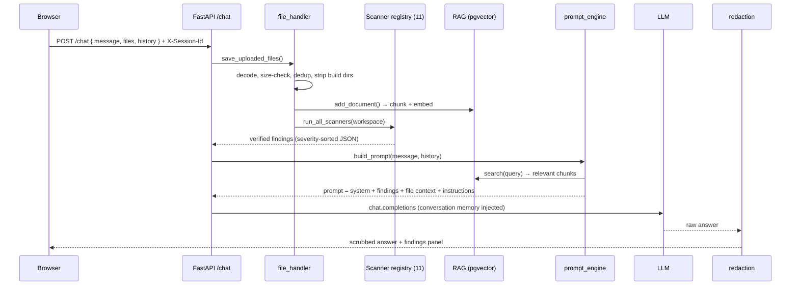

# How It Works

A narrative walkthrough of what happens between "upload a file" and
"here are your findings." The guiding principle: **the scanners produce
ground truth; the LLM reasons on top of it, never instead of it.**

## Table of contents

- [The one-sentence version](#the-one-sentence-version)
- [Request lifecycle](#request-lifecycle)
- [Step by step](#step-by-step)
- [Intent routing — the four modes](#intent-routing--the-four-modes)
- [Async repository ingestion](#async-repository-ingestion)
- [Retrieval (RAG)](#retrieval-rag)
- [Conversation memory](#conversation-memory)
- [Why findings can be trusted](#why-findings-can-be-trusted)
- [Related docs](#related-docs)

---

## The one-sentence version

You send content (a file, a `.zip`, or a GitHub URL); deterministic scanners
turn it into a verified findings list; that list plus relevant file context
becomes an LLM prompt; the model explains, prioritizes, and remediates; the
answer is scrubbed of secrets and returned alongside the structured findings.

## Request lifecycle

## Step by step

1. **Session binding.** Every request carries an `X-Session-Id` header
   (client-generated per browser tab). A `ContextVar` binds it so
   module-level accessors — memory, RAG store, secret registry — resolve to
   the right user's state without threading a session object everywhere.
   (`backend/session.py`)

2. **File intake.** Uploaded files are base64-decoded, size-checked, and
   deduplicated; dependency/build directories (`node_modules`, `.git`,
   `.terraform`, …) are stripped so findings come from *your* code. Each file
   is written to a per-session workspace directory the scanner subprocesses
   read from, and its content is registered for secret redaction.
   (`backend/file_handler.py`)

3. **Scanning.** `run_all_scanners()` runs all **11** scanners in parallel on
   worker threads (they're independent subprocesses), crash-isolated so one
   failing tool never breaks the batch. Results are merged, severity-sorted,
   and cached on the session as ground truth. (`backend/scanners/`)

4. **Intent + prompt building.** `detect_intent()` short-circuits greetings,
   small talk, acknowledgements, and off-topic questions *before* any LLM
   call. Everything else goes to `build_prompt()`, which selects a mode and
   assembles the prompt from the system prompt, the scanner findings, relevant
   file context (via RAG), and formatting instructions. (`backend/intent_engine.py`,
   `backend/prompt_engine.py`)

5. **Reasoning.** `ask_openai()` sends the prompt to the configured LLM,
   injecting conversation memory (a rolling summary + recent turns). On a
   rate-limit it retries once with a smaller completion reservation.
   (`backend/llm.py`, `backend/conversation.py`)

6. **Redaction.** Every answer is scrubbed of secret values at the code level
   before it leaves the API — a guarantee no prompt rule can make.
   (`backend/redaction.py`)

7. **Response.** The client gets the prose answer plus the structured findings
   (rendered in a dedicated panel), any upload warnings, and — on a file
   analysis turn — the scanner list and file counts.

## Intent routing — the four modes

`build_prompt()` picks a mode so the model gets the right instructions:

| Mode | Trigger | Behavior |
|---|---|---|
| **File analysis** | files present + an analysis ask | Full security report grounded in scanner findings |
| **Generation** | "write me a Dockerfile / terraform …" | Produces the artifact (pinned, non-root, least-priv) — no findings panel |
| **General knowledge** | a DevOps question, files incidental | Explains the concept; won't re-surface old findings |
| **Plain chat** | no files | Senior-engineer Q&A |

Generation is deliberately distinct so "write me a hardened Dockerfile"
produces a file instead of re-auditing your existing one, and is always
labeled a *generated example*.

## Async repository ingestion

Pasting a GitHub URL kicks off a **background job** (a thread pool) that
downloads and scans the repo, so the request returns immediately with a
`job_id`; the UI polls `/scan-status/{job_id}` until findings are ready.
Large repos never time out the request or stall the event loop.
(`backend/github_ingest.py`, `backend/jobs.py`)

## Retrieval (RAG)

File content is chunked, embedded (`text-embedding-3-small`), and stored in
**pgvector** (or in-process FAISS when `DATABASE_URL` is unset). At query
time a **hybrid** search — semantic similarity plus keyword/​filename boosts —
retrieves the most relevant chunks so a repo-scale prompt stays focused.
Embedding calls are sub-batched to respect the provider's per-request token
cap. (`backend/rag.py`)

## Conversation memory

Beyond the last few turns, an authoritative **server-side turn log** plus a
**rolling summary** (a cheap-model summarization of turns that age out of the
verbatim window) let long conversations retain earlier facts — a region, a
budget, a compliance target stated 20 turns ago. (`backend/conversation.py`)

## Why findings can be trusted

Because findings are produced by deterministic tools *before* the model
reasons, the model can't invent them. Every finding is tagged
`[SCANNER-VERIFIED]` or `[AI-DETECTED]`, secrets are redacted at the code
level, and file-borne prompt injection is reported as a finding rather than
obeyed. This is exactly what makes the output [measurable](./EVALUATION.md).

## Related docs

- [Architecture](./ARCHITECTURE.md) — the components and how they connect
- [Design decisions](./DESIGN-DECISIONS.md) — why it's built this way + limits
- [Security model](./SECURITY.md) — redaction, injection, supply chain
- [Evaluation](./EVALUATION.md) — how we prove it works
- [Developer guide](./developer-guide.md) — run it and extend it
